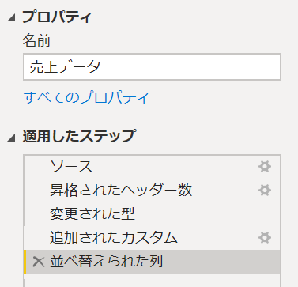
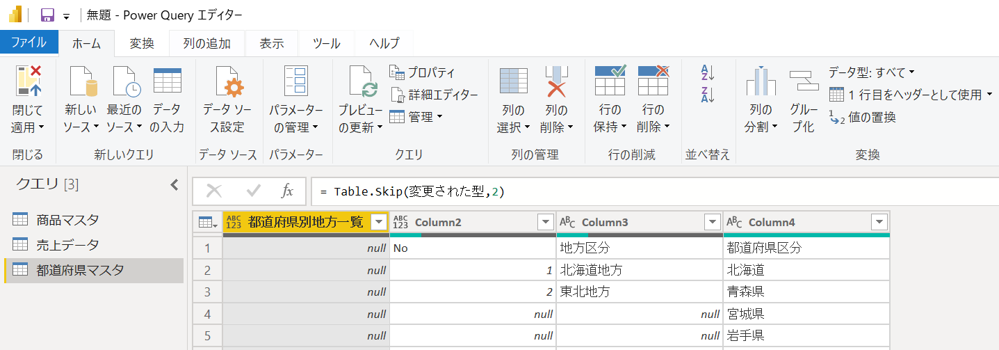
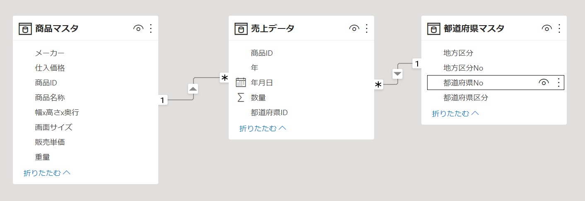
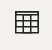
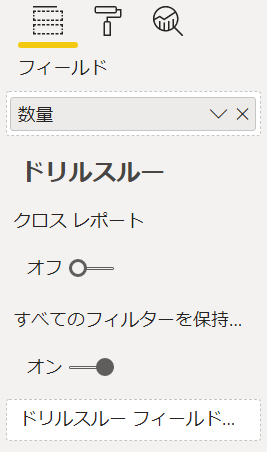
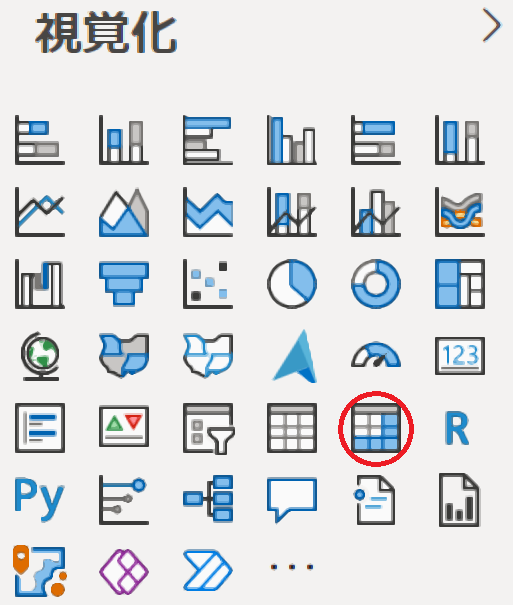

# Power BI Hands-on training

## csv ファイルをソースとしたレポート作成

<br />

### **INDEX**

- [CSV ファイルからデータを取得](#CSV-ファイルからデータを取得)
- [Excel ブックからデータを取得](#Excel-ブックからデータを取得)
- [メジャーの作成](#メジャーの作成)
- [レポートの作成](#レポートの作成)

<br />

### **CSV ファイルからデータを取得**

- Power BI Desktop を起動

- **データを取得** - **テキスト/CSV** をクリック

  

- **商品マスタ.csv** を選択し **読み込み** を選択

  - 元のファイル： **65001: Unicode (UTF-8)**

  - 区切り記号： **コンマ**

  - データ型検出： **最初の 200 行に基づく**

    

- **データを取得** - **テキスト/CSV** をクリック

- **売上データ.csv** を選択し、**データの変換** をクリック

  - 元のファイル： **65001: Unicode (UTF-8)**

  - 区切り記号： **コンマ**

  - データ型検出： **最初の 200 行に基づく**

    

- Power Query エディターが起動

  

- **列の追加** タブを選択し **カスタム列** をクリック

  

- 列名、式を入力し **OK** をクリック

  - 新しい列名： **年**

  - カスタム列の式： 

    ```
    Text.From(Date.Year([年月日])) & "年"
    ```

    

- **年** 列が追加

- 年列をドラッグし、年月日列の右へドロップ

  

- 年列が左から２列目へ移動

  

- 行った操作がすべて記録されていることを確認

  

- **ホーム** タブを選択し **閉じて適用** をクリック

  

- フィールドに読み込んだデータが表示

  

<br />

### **Excel ブックからデータを取得**

- **データを取得** - **Excel ブック** をクリック

- **都道府県.xlsx** を選択して開く

- **都道府県マスタ** シートを選択し **データの変換** をクリック

  

- Power Query エディターが起動

  

- **行の削除** - **上位の行の削除** を選択

  

- 削除する行数に **2** を入力し **OK** をクリック 

  

- 不要な上位２行が削除

  

  ※実行した処理はステップとして記録

  

  ※ステップは追加・更新・削除が可

- **都道府県別地方一覧** 列を列名をクリックして選択

- **列の削除** - **列の削除** を選択

  

- 不要な列を削除

  

- **1 行目をヘッダーとして使用** をクリック

  

- 地方区分、都道府県区分が列名に変換

  

- **No** 列を選択

- **変換** メニューを表示し、**名前の変更** をクリック

  

- 列名を **地方区分No** に変更

  

- **地方区分No** 列と **地方区分** 列を選択

  

  ※Ctrl キーを押しながら２つの列を選択

- **フィル** - **下** をクリック

  

- null 値のレコードに上の行の値がコピー

  

- **インデックス列** - **1 から** をクリック

  

- テーブルにインデックス列が追加

  

- 列名を右クリックし **名前の変更** を選択

  

- 列名を **都道府県No** に変更

  

- **移動** - **先頭に移動** を選択

  

- **都道府県No** 列がテーブルの先頭へ移動

  

- 行った操作がすべて記録されていることを確認

  

- **ホーム** タブを選択し **閉じて適用** をクリック

  

- フィールドに **都道府県マスタ** が追加

  

- 画面左の **モデル** () をクリック

- 取り込んだデータがテーブルとして表示

  

- **都道府県マスタ** の **都道府県No** 列をドラッグし **売上データ** の **都道府県ID** へドロップ

- 売上データと都道府県マスタの間にリレーション シップが作成

  

- **都道府県マスタ** の **地方区分** を右クリックし、メニューから **階層の作成** をクリック

  

- **地方区分 階層** が追加

  

- **都道府県区分** を右クリックし、メニューから **階層に追加** - **地方区分 階層** を選択

  

- **地方区分 階層** に **都道府県区分** が追加

  


<br />

### **メジャーの作成**

- 画面左の **データ** () をクリック

- **売上データ** を選択

- **新しい列** をクリック

  

- 数式を入力し Enter キーを押下

  ```
  販売単価 = RELATED('商品マスタ'[販売単価])
  ```

  

- 書式を設定

  - 書式： **通貨**

  - ＄： **¥ 日本語 (日本)**

    

- 同様の手順で３つの列を追加

  - 売上列

    ```
    売上 = [販売単価] * [数量]
    ```

    書式を通貨、日本円に設定

  - 仕入価格列

    ```
    仕入価格 = RELATED('商品マスタ'[仕入価格] 
    ```

    書式を通貨、日本円に設定

  - 粗利益列

    ```
    粗利益 = ([販売単価]-[仕入価格])*[数量]
    ```

    書式を通貨、日本円に設定

- **テーブル ツール** タブの **新しいメジャー** をクリック

  

- 数式を入力し、書式を設定

  ```
  売上合計 = SUM('売上データ'[売上])
  ```

  

  書式を通貨、日本円に設定

- 同様の手順で２つのメジャーを作成

  - 粗利益合計メジャー

    ```
    粗利益合計 = SUM('売上データ'[粗利益])
    ```

    書式を通貨、日本円に設定

  - 粗利率メジャー

    ```
    粗利率 = DIVIDE([粗利益合計], [売上合計])
    ```

    書式をパーセンテージ、小数点以下の桁数 2 に設定

- 売上データ

  

<br />

### **レポートの作成**

- 画面左のレポート () をクリック

- **視覚化** の **カード** をクリック

  

- **売上合計** をドラッグし **フィールド** にドロップ

  

- **書式** () をクリック

- **データ ラベル** を展開し **表示単位** を **百万** に変更

  

- **背景** を展開し、**テーマの色** を選択

  

- 幅、高さ、配置場所を調整

  

- 同様の手順でカードを配置し、フィールドに **数量** を設定

  

- 幅、高さ、配置場所を調整

  

- **視覚化** の **スライサー** をクリック

  

- **年月日** をドラッグし、**フィールド** にドロップ

  

- 同様の手順でスライサーを配置

- **地方区分** をドラッグし、**フィールド** にドロップ

  

- **書式** () をクリック

- **全般** を展開し **方向** を **横** に設定

  

- **項目** を展開し **フォントの色**、**背景** を設定

  

- 幅、高さ、配置場所を調整

  

- **視覚化** の **リボン** をクリック

  

- **軸**、**凡例**、**値** にフィールドを配置

  - 軸： **年月日** (売上データ)

  - 凡例： **商品名称** (商品マスタ)

  - 値： **売上合計** (売上データ)

    

- 幅、高さ、配置場所を調整

  

-  をクリック

  

- １レベル下の階層（四半期）まで展開して表示

  

- **視覚化** の **ドーナッツ グラフ** をクリック

  

- **凡例**、**値** を指定

  - 凡例： **商品名称** (商品マスタ)

  - 値： **売上合計** (売上データ)

    

- 幅、高さ、配置場所を調整

  

- 同様の手順でドーナッツ グラフを設定

  - 凡例： **商品名称** (商品マスタ)

  - 値： **数量** (売上データ)

    

- 幅、高さ、配置場所を調整

  

- **視覚化** の **マトリックス** をクリック

  

- **行**、**値** を指定

  - 行： **地方区分 階層** (都道府県マスタ)

  - 値： **売上合計**, **数量**, **粗利益合計**, **粗利率** (売上データ)

    

- 幅、高さ、配置場所を調整

  

- 画面左の **データ** () をクリック

- **都道府県マスタ** を選択し、**地方区分** 列を選択

  

- **列で並べ替え** - **地方区分No** を選択

  

- 同様の手順で **都道府県区分** を **都道府県区分No** で並べ替え

  

- 画面左のレポート () をクリック

- 地方区分が北海道から九州の順にソートされることを確認

  

-  をクリック

- 都道府県レベルまで展開されることを確認

  

- **書式** () をクリック

- 検索ボックスに **階段** と入力

- **階段状レイアウト** を **オフ** に設定

  

- 都道府県区分が列として表示されることを確認

  

- レポートの完成

  

- スライサーのフィルタリングがすべてのビジュアルに反映されることを確認

  

- **ファイル** メニューの **名前を付けて保存** で作成したレポートを保存
