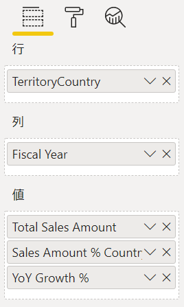
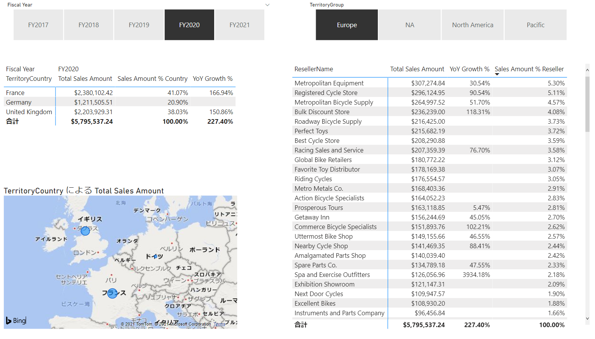

# Power BI Hands-on training

## Azure SQL Database をソースとしたレポート作成

<br />

### **データベースからのデータ取得**

- Power BI Desktop を起動

- **データを取得** - **詳細** をクリック

  

- **Azure SQL Database** を選択し、**接続** をクリック

  

- サーバー名を入力し、**OK** をクリック

  

  ※データ接続モードはインポートを選択（既定）

- **データベース** タブを選択し、ユーザー名とパスワードを入力後 **接続** をクリック

  

- **FactResellerSales** テーブルを選択

  

- **関連テーブルの選択** をクリック

  FOREIGN KEY 制約によって関連付けが設定されたテーブルがすべて選択

  - DimEmployee
  - DimProduct
  - DimPromotion
  - DimReseller
  - DimSalesTerritory

    

- **読み込み** をクリックして、データのインポートを実行

- 画面右の **フィールド** に取得したテーブルが表示されることを確認

  

- 画面左の **モデル** () をクリック

- 取得したテーブル間のリレーション シップを表示

  

<br />

### **日付テーブルの作成**

- 画面左の **データ** () をクリック

- **新しいテーブル** をクリック

  

- **CALENDAR** 関数を入力し **Enter** キーを押下

  ```
  DimDate = CALENDAR("2018/01/01", "2021/12/31")
  ```

  

  ※式の左辺にテーブル名を指定、この手順では DimDate の名前でテーブルを作成

- 指定した日付が入力された１列のテーブルが作成

  

- **新しい列** をクリック

- **YEAR** 関数を使用し日付から年を取得

  ```
  Year = Year(DimDate[Date]) & "年"
  ```

  

  ※式の左辺に列名を指定、この手順では Year の名前で列を作成

- テーブルに **Year** 列が追加

  

- 同様の手順で以下の列を追加

  - Month 列
    ```
    Month = FORMAT(DimDate[Date], "MM月")
    ```

  - WeekDay 列
    ```
    WeekDay = SWITCH(WEEKDAY(DimDate[Date]), 1, "日曜日", 2, "月曜日", 3, "火曜日", 4, "水曜日", 5, "木彫日", 6, "金曜日", "土曜日")
    ```

  - WeekDayKey 列
    ```
    WeekDayKey = WEEKDAY(DimDate[Date])
    ```

  - Fiscal Year 列
    ```
    Fiscal Year = IF(MONTH(DimDate[Date])<4, "FY" & Year(DimDate[Date])-1, "FY" & Year(DimDate[Date]))
    ```

  - Quarter 列
    ```
    Quarter = IF(MONTH(DimDate[Date])<4, "Q4", IF(MONTH(DimDate[Date])<7, "Q1", IF(MONTH(DimDate[Date])<10, "Q2", "Q3")))
    ```

  - QuarterKey 列
    ```
    QuarterKey = DimDate[Fiscal Year] & " " & DimDate[Quarter] 
    ```

  - Fiscal Month 列
    ```
    Fiscal Month = DimDate[Fiscal Year] & FORMAT(DimDate[Date], "-MMM")
    ```

  - Fiscal Month Key 列
    ```
    Fiscal Month Key = YEAR(DimDate[Date]) * 100 + MONTH(DimDate[Date])
    ```

- **Fiscal Month** 列を選択し **列で並べ替え** をクリック

  

- **Fiscal Month Key** を選択

  

- 同様の手順で **WeekDay** の並べ替えに使用する列に **WeekDayKey** を指定

  

  ※上記の操作によりレポートへ表示の際に指定した列でソートが実行

  

- **テーブル ツール** メニューの **日付テーブルとしてマークする** をクリック

  

- 日付列に **Date** を選択し、**OK** をクリック

  

- 画面左の **モデル** () をクリック

- **DimDate** テーブルの **Date** 列をドラッグし、**FactResellerSales** テーブルの **OrderDate** 列にドロップ

  

- テーブルのリレーション シップはテーブルを右クリックして表示される **リレーション シップの管理** からも確認・作成は可

  

<br />

### **メジャーの作成**

- 画面左の **データ** () をクリック

- 画面右のフィールドで **FactResellerSales** テーブルを選択

- **Unit Price** 列を選択

  書式の通貨で **$ 英語 (米国)** 

  

  小数点以下の桁数に 2 を入力

  

- 同様の手順で **Sales Amount** 列の書式を米ドル、小数点以下 2 桁に変更

- **新しいメジャー** をクリック

  

- 売上合計のメジャーを作成

  ```
  Total Sales Amount = SUM(FactResellerSales[SalesAmount])
  ```

  ※左辺がメジャーの名前、この手順では Total Sales Amount の名前で作成

  ※書式を米ドル、小数点以下 2 桁に設定

- 同様の手順で 5 つのメジャーを作成
  - 注文のユニーク数を求める **Orders** メジャー

    ```
    Orders = DISTINCTCOUNT(FactResellerSales[SalesOrderNumber])
    ```

    ※DISTINCTCOUNT() 関数は値を１回だけカウント

  - 明細行をカウントする **Order Lines** メジャー

    ```
    Order Lines = COUNTROWS(FactResellerSales)
    ```

    ※COUNTROWS() 関数は指定したテーブル内の行数をカウント

  - 年成長率を求める **YoY Growth %** メジャー

    ```
    YoY Growth % =
      VAR SalesPriorYear =
        CALCULATE([Total Sales Amount], PARALLELPERIOD(DimDate[Date], -12, MONTH))
      RETURN
        DIVIDE(([Total Sales Amount] - SalesPriorYear), SalesPriorYear)
    ```

    数式バーは広げることが可能

    

    メジャー式内では変数を宣言することも可能

    変数を使用することで数式内で式を複数評価する際の効率が UP

    書式をパーセンテージ、小数点以下の桁数を 2 に設定

    

  - 国の売上占有率を求める **Sales Amount % Country** メジャー

    ```
    Sales Amount % Country =
    DIVIDE(
      [Total Sales Amount], CALCULATE([Total Sales Amount], REMOVEFILTERS(DimSalesTerritory[TerritoryCountry]))
    ) 
    ```

    書式をパーセンテージ、小数点以下の桁数を 2 に設定

  - 販売会社の売上占有率を求める **Sales Amount % Reseller** メジャー

    ```
    Sales Amount % Reseller =
    DIVIDE(
      [Total Sales Amount], CALCULATE([Total Sales Amount], REMOVEFILTERS(DimReseller[ResellerName]))
    )
    ```

    書式をパーセンテージ、小数点以下の桁数を 2 に設定

<br />

### **フィールドの整理**

- 画面左の **モデル** () をクリック

- フィールドの FactResellerSales テーブル下の **Orders** メジャーを選択

  

- **プロパティ** の **フィールドの表示** に **Counts** と入力

  

- 同様の手順で **Order Lines** メジャーのフォルダーの表示にも **Counts** を入力

- **Counts** フォルダ配下に２つのメジャーが表示

  

  ※フィールドが多い場合にフォルダを作成し整理することが可

- 同様の手順で４つのメジャーの表示フォルダに **Sales** を設定

  

- **Sales** フォルダ配下に４つのメジャーが表示

  

- FactResellerSales テーブルの **Sales Amount** 列を選択

- **非表示** を **はい** に設定

  

- 同様の手順で以下の列を非表示に設定

  - FactResllerSales - Unit Price 列

  - DimDate - Date, Fiscal Month Key, WeekDayKey 列

- 非表示設定を行った列には  アイコンが表示

  DimDate テーブル
  

  FactResellerSales テーブル
  

<br />

### レポートの作成

- 画面左のレポート () をクリック

- **視覚化** の **スライサー** をクリック

  

- **フィールド** へ **DimDate** - **Fiscal Year** をドラッグ＆ドロップ

  

- **書式** () をクリック

- **全般** を選択し、**方向** を **横** に設定

  

- レポート画面で 1 行で表示されるよう幅と高さを調整

  

- 新しいスライサーを配置し、フィールドに **DimSalesTerritory** - **TerritoryGroup** を設定

- 同様の設定を行い Fiscal Year スライサーの横へ配置

  

- レポートの空白部分をクリックし、**視覚化** の **マトリックス** をクリック

  

- 表示するフィールドを指定

  - 行： **TerritoryCount** (DimSalesTerritory テーブル)

  - 列： **Fiscal Year** (DimDate テーブル)

  - 値： **Total Sales Amount**, **Sales Amount % Country**, **YoY Growth %** (FactResellerSales テーブル)

    

- **書式** () をクリック

- **小計** を展開し、**列の小計** を **オフ** に設定

  

- レポート画面で１年分の値が表示されるよう幅と高さを調整

  

- レポートの空白部分をクリックし、**視覚化** の **マップ** をクリック

- 表示するフィールドを指定

  - 場所： **TerritoryCountry** (DimSalesTerritory テーブル)

  - サイズ： **Total Sales Amount** (FactResellerSales テーブル)

    

- レポート画面でサイズを調整

  

- レポートの空白部分をクリックし、**視覚化** の **マトリックス** をクリック

  

- 表示するフィールドを指定

  - 行： **ResellerName** (DimReseller テーブル)

  - 値： **Total Sales Amount**, **Sales Amount % Reseller**, **YoY Growth %**

    

- レポート画面で幅と高さを調整

- **Sales Amount % Reseller** をクリックし、降順でソート

  

- スライサーの値を選択し、フィルタリングが行われることを確認

  

  ※確認後はフィルタリングを解除してください。

  ※スライサーの消しゴムアイコンをクリックすることでフィルタは解除されます。

<br />

### 行レベル セキュリティの設定

- **モデリング** メニューを選択し **ロールの管理** をクリック

  

- **作成** をクリック

  

- **新しいロール** を **Europe** に変更

  

- **DimSalesTerritory** の **...** をクリック

  **フィルターの追加** - **TerritoryGroup** を選択

  

- **テーブル フィルターの DAX 式** の値を **Europe** に変更し、**保存** をクリック

  

  - DAX 式

    ```
    [TerritoryGroup] = "Europe"
    ```

- **モデリング** メニューの **表示方法** をクリック

  

- **Europe** を選択し **OK** をクリック

  

- ロールに属したユーザーでアクセスした際の表示内容を確認

  

  ※ロールに属すユーザーの設定は Power BI Service で行います。

- **表示の停止** をクリックし、ロールのビューを解除

- **ファイル** メニューの **名前を付けて保存** を選択しレポートを保存

<br />

### クラウド サービスへの発行

- **ファイル** メニューの **発行** - **Power BI へ発行** へ発行を選択

  

  ※変更を保存しますか？のメッセージが表示された際は **はい** を選択

- 宛先で **マイ ワークスペース** を選択し、**選択** をクリック

  

- 成功しました！ と表示されクラウドへの発行が完了したことを確認

  **Power BI で xxx を開く** をクリック

  ※ xxx はレポートを保存した際に付けたファイル名

  

- Web ブラウザが起動し、レポートが表示

  

<br />

### レポートの設定

- **マイ ワークスペース** をクリック

- 発行したレポートをフォーカスし **共有** () をクリック

  

- **リンクの送信** ウィンドウが表示

  

  ※レポートを共有したいユーザーの名前 OR メールアドレスを入力し **送信** をクリックすることでレポートを共有

  ※共有するユーザーには Power BI のライセンスが必要となるので注意

- **データセット + データフロー** を選択

- 発行したレポートのデータセットにフォーカスし  をクリック

  

- 表示されるメニューから **セキュリティ** を選択

  

- レポートで作成したロールが表示

  

  ※メンバーに追加されたユーザーは許可された範囲でのみレポートを参照

<br />

### 更新スケジュールの設定

- 画面右上の歯車アイコンをクリックし **設定** を選択

  

-  **データセット** タブを表示し、発行したレポートのデータセットを選択

- **データ ソースの資格情報** を展開

  

- **資格情報を編集** をクリック

- ユーザー名、パスワードに SQL 認証の資格情報を入力し **サインイン** をクリック

  

- **スケジュールされている更新** を展開

- データ更新のスケジュールを設定し **適用** をクリック

  
