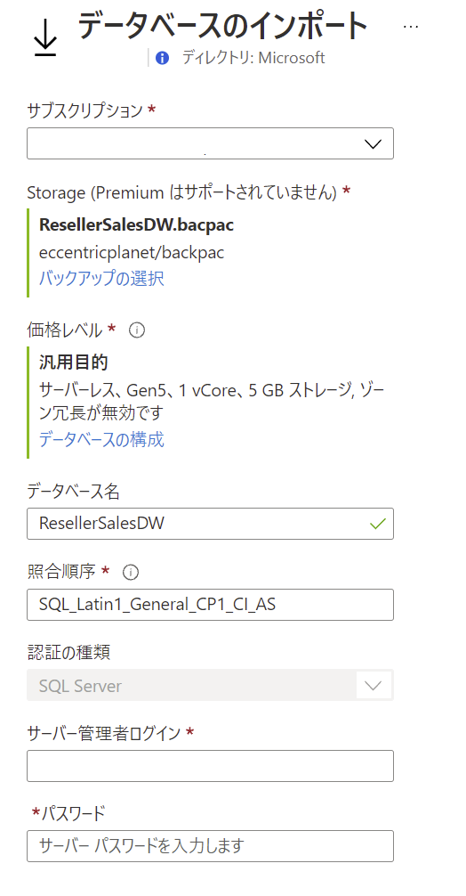
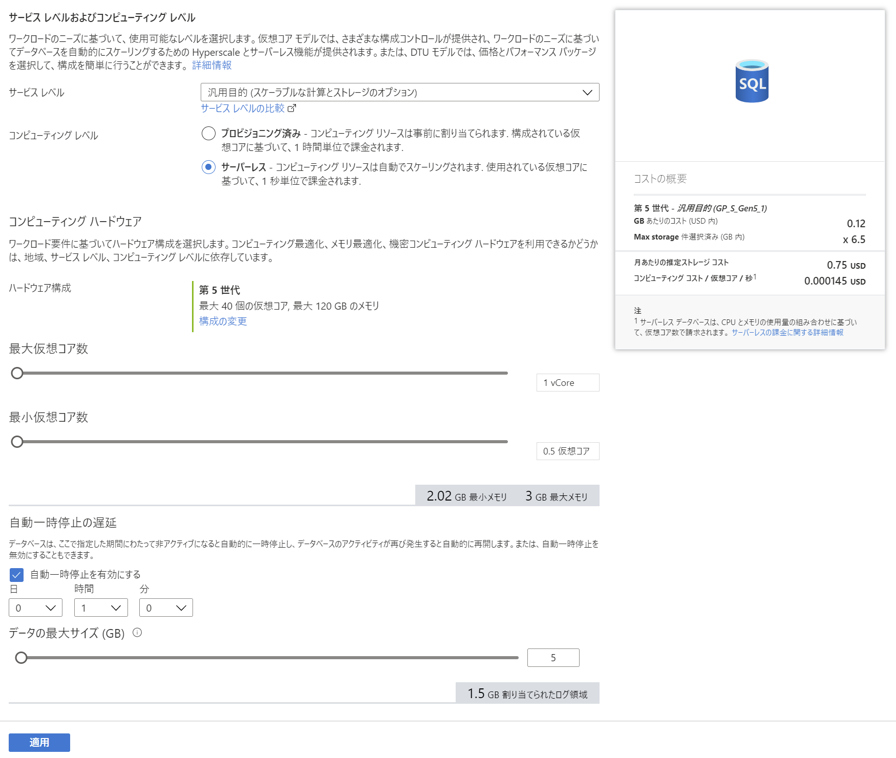

# Power-BI-Training

 

## Azure リソースの作成

事前にリソースを展開するためのリソース グループを作成

- **ARM テンプレート**

  使用する Azure リソースを作成（指定パラメーター以外の設定は以下）

  - **ストレージ アカウント**

    - ストレージ冗長性： Local

    - アクセス層： Hot

  - **SQL Sever**

    - Azure サービスおよびリソースからのアクセス許可のファイアウォール ルールを追加

   

  

  ### パラメーター
  - **storageAccountName**: ストレージ アカウント名
  - **sqlServerName**: SQL Server 名
  - **sqlAdministratorLogin**: サーバー管理者
  - **sqlAdministratorPassword**: パスワード

 

## コンテンツの準備

- コンテンツのダウンロード

  <a href="">https://github.com/hiroyay-ms/Azure-Data-Factory-Training</a> を表示
  
   **Code** をクリックし、**Download ZIP** を選択、ダウンロード後、任意の場所に解凍

- コンテナーの作成

  - リソース グループから作成したストレージ アカウントを表示

  - 左側のメニューにある **コンテナー** をクリック

  - **＋ コンテナー** をクリックし、新しいコンテナーを作成

    - **名前**： （任意）3 文字以上、63 文字以下で小文字、数字、ハイフンのみ可

    - **パブリック アクセス レベル**: プライベート（匿名アクセスはありません）

- ファイルのアップロード

  - 作成したコンテナーにアクセスし、**アップロード** をクリック

  - ダウンロードしたコンテンツ内の Database フォルダーの **ResellerSalesDW.bacpac** ファイルをアップロード

- データベースのインポート

  - リソース グループから作成した SQL Server を選択

  - **データベースのインポート** をクリック

  - バックアップの選択、データベースの構成を行い、管理者のパスワードを入力

    

    ※ バックアップは先の手順でアップロードした **ResellerSalesDW.bacpac** ファイルを選択

    ※ データベースの構成

    - サービス レベル： **汎用目的**（既定）

    - コンピューティング レベル： **サーバーレス**

    - ハードウェア構成： **第 5 世代**（既定）

    - 最大仮想コア数/最小仮想コア数： **1 vCore** / **0.5 仮想コア**

    - 自動一時停止： **自動一時停止を有効にする**（既定）/1 時間

    - データの最大サイズ： **5** GB

    

  - **OK** をクリックし、データベースのインポートを実行